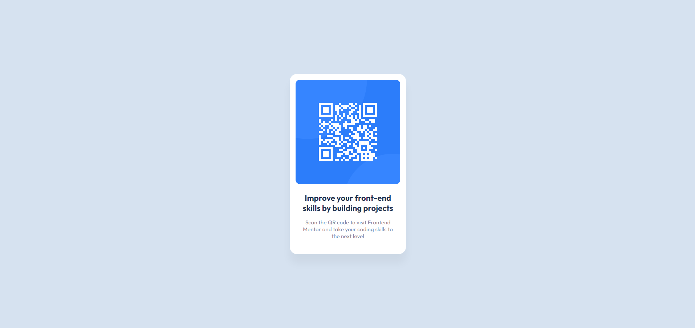

# Frontend Mentor - QR code component solution

This is a solution to the [QR code component challenge on Frontend Mentor](https://www.frontendmentor.io/challenges/qr-code-component-iux_sIO_H). Frontend Mentor challenges help you improve your coding skills by building realistic projects.

## Table of contents

- [Overview](#overview)
  - [Screenshot](#screenshot)
  - [Links](#links)
  - [Built with](#built-with)
  - [What I learned](#what-i-learned)
- [Author](#author)

## Overview

### Screenshot

### Links

- Solution URL: [https://www.frontendmentor.io/solutions/qr-code-component-26PwD6mv8K](https://www.frontendmentor.io/solutions/qr-code-component-26PwD6mv8K)
- Live Site URL: [https://qr-code-component-tr.netlify.app/](https://qr-code-component-tr.netlify.app/)

### Built with

- Semantic HTML5 markup
- CSS custom properties
- CSS Grid

### What I learned

I learnt how to use Figma for designing pixel-perfect CSS.

## Author

- Website - [Thomas ROBERT](https://thomasrobert.netlify.app/)
- Frontend Mentor - [@Fixito](https://www.frontendmentor.io/profile/Fixito)
